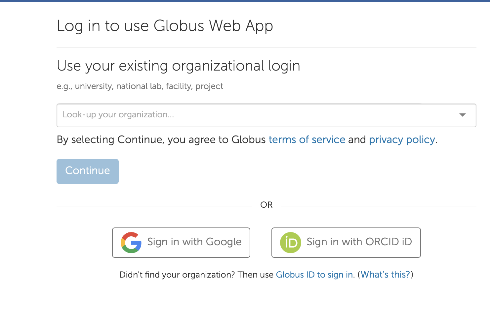
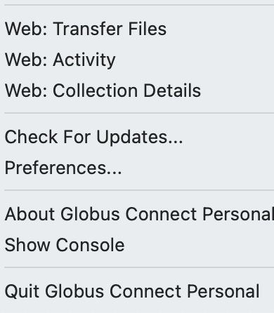
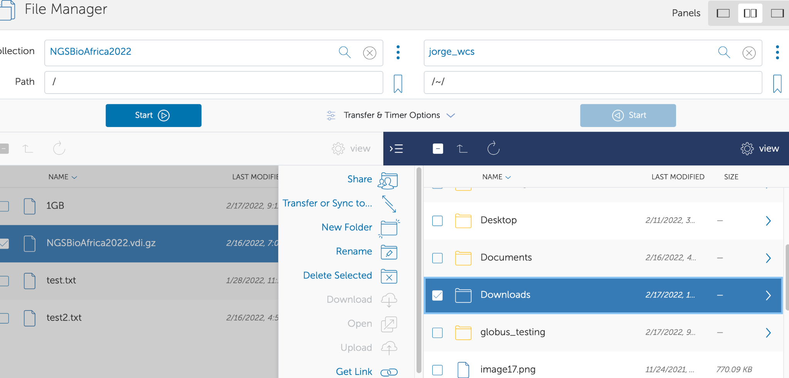

**Download of the GSBAfrica Virtual Machine (VM) image**

The VM is a large download that many users struggle with.

We are going to use Globus software to help with this. Globus is file
transfer software designed for research. Here is a [video](https://youtu.be/qYZAIVlLJQ8) of this tutorial.

<!-- YT: [https://youtu.be//qYZAIVlLJQ8 ](https://youtu.be/qYZAIVlLJQ8)--->
<iframe width="840" height="472" src="https://www.youtube.com/embed//qYZAIVlLJQ8" title="YouTube video player" frameborder="0" allow="accelerometer; autoplay; clipboard-write; encrypted-media; gyroscope; picture-in-picture; web-share" allowfullscreen></iframe>      

Globus website:

[https://www.globus.org](https://www.globus.org)

VirtualBox is used to run the VM once it is downloaded. Be sure to check which version in the install instructions for your course specific VM. 

[https://www.virtualbox.org](https://www.virtualbox.org)

Steps:

1.  Make a globus connect personal account by going this webpage, and choosing the download for your operating system, which will prompt you to make an account: [https://www.globus.org/globus-connect-personal](https://www.globus.org/globus-connect-personal)

Choose use "Globus ID to sign in" (on bottom)

Then if you dont have an ID yet, select "Need a Globus ID? Sign up"

Then make sure you specify for research or
educational purposes. And create your account. Remember your password
for the later steps.

2.  Then download the globus client onto your local machine (or where you intend to run the VM), allow it to install. It will ask for a collection name, give it a name you will refer to - example "home_computer" or "local_mac". This is a name for the local folders on your computer that we will send the VM to in a later step.

3.  Click on the small "g" icon on the task bar and select Web: Transfer Files. For linux users - there may not be a shortcut. Once you
 start globus personal connect via command line, navigate to [https://app.globus.org/file-manager](https://app.globus.org/file-manager) to begin the file manager.

4.  You will see your own files on this page. Your local collection / endpoint is your computer. Click on "Collections" on the left

5.  Search for the endpoint at **wcs_data_transfers**

Click on the endpoint labelled **wcs_data_transfer**

Then click on "Open in File Manager" will open up a file manager

6.  Then we begin the steps to transfer the VM to your local machine. First, select the VM file corresponding to your course name with the check box. NOTE the example VM in the image below is not your course VM name, you must check the name listed below in text and select that. 

#### Course VM name
The GSBAfrica course VM is **GSBAfrica2023.vdi.zip*

Then click on "Transfer or sync to"

Then click on the search box in the opposite panel (if you dont see two panels, click the middle option of "Panels" on the top right)

Click on the "Your Collections", and select your local endpoint (the name will be what you gave it during the globus personal connect installation)

You can browse to choose the specific directory or folder on your local machine you want the VM to download to. 

7.  When you have chosen the local location, Click on the "Start" button under the "**wcs_data_transfer**" section to begin the download to your local endpoint / collection.

8.  Wait for download completion - it will email you to the account you set up, and you can track the transfer in the "Activity" menu.

9.  Run the installation of Virtualbox, then install the virtual machine you have just downloaded. See install docs on the manual, including the VM install video.

Note - if you encounter severe problems with globus, such as it being blocked on an institutional firewall, then there is a backup option to download via google drive. You will need to contact the core team for the link. Please note, this is only to be used when you cannot use another option for globus, as the google drive download requires a very strong and stable connection, and can fail often. 

NB Caution, direct downloads can break easily, and lead to corrupted VMs, use the md5 checksum to check if your VM is as it should be.

#### Testing the integrity of the downloaded VM
You can do an MD5 check to validate the downloaded VM. 
to do an md5 check - https://portal.nutanix.com/page/documents/kbs/details?targetId=kA07V000000LWYqSAO

The md5 for  **GSBAfrica2023.vdi.zip*  is:
MD5 (GSBAfrica2023.vdi.zip) = 506447d3002d086cd1eb54fb65b53a48
